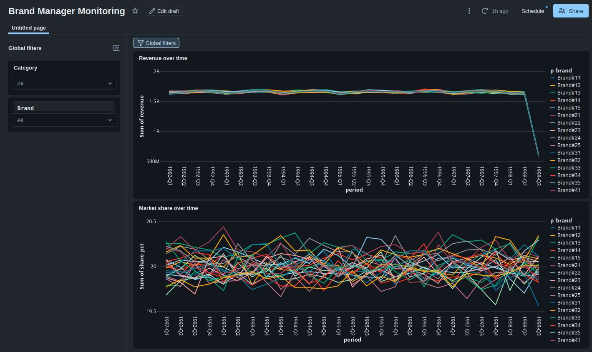

# shtrudel_team_brand-manager
## Presentation
https://canva.link/edikligoom29wzo
## Overview

This homework builds a Bronze → Silver → Gold Lakehouse for the
TPC-H Brand Manager profile using Databricks and Delta tables.

The source is `samples.tpch`. The solution answers four business
questions about brand revenue, market share, product margins and
sale-price deviations.

## Repository structure

- `notebooks/`: configuration, ingestion, validation and Gold analysis.
- `docs/`: Silver ER diagram, dashboard screenshots and presentation.
- `pyproject.toml` and `uv.lock`: homework configuration and dependency lock.
- `README.md`: setup, metric definitions, design decisions and results.

## Local setup

Clone the repository and run:

    uv sync

The notebooks run in Databricks because they use the workspace-provided
Spark session and Unity Catalog tables. `uv sync` prepares the local
Python project; it does not execute the Databricks pipeline.

## Configuration

All processing notebooks load `00_config` using `%run ./00_config`.

| Parameter | Default |
|---|---|
| SOURCE_CATALOG | samples |
| SOURCE_SCHEMA | tpch |
| TARGET_CATALOG | workspace |
| BRONZE_SCHEMA | brand_bronze |
| SILVER_SCHEMA | brand_silver |
| GOLD_SCHEMA | brand_gold |

To use another target catalog or schema, update these values before
running the pipeline.

The execution identity must have access to the source and permission
to create schemas and tables in the target catalog. Access grants are
managed separately from the processing notebooks.

## How to run

Import or open the repository notebooks in Databricks, keeping them
in the same notebook folder so relative `%run` paths resolve.

Run the notebooks in this order:

1. `01_bronze`
2. `02_silver`
3. `gold_brand_q1_q2 (2)`
4. `gold_brand_q3_q4`

Each notebook loads `00_config` automatically.

The Databricks Job `brand_manager_pipeline` should use the same task
order. Q3–Q4 depends on Q1–Q2 because it reads the Gold table
`brand_revenue`.

## Bronze ingestion

Bronze copies all eight TPC-H tables without changing source columns
or values:

`customer`, `lineitem`, `nation`, `orders`, `part`, `partsupp`,
`region` and `supplier`.

Three metadata columns are added:

| Column | Meaning |
|---|---|
| `_loaded_at` | Timestamp of the ingestion write |
| `_source_table` | Fully qualified source table name |
| `_run_id` | Identifier shared by all tables in one Bronze run |

Bronze uses Delta tables and full overwrite on each run.

## Validation across layers

Validation is included in the processing notebooks.

- Source → Bronze: row counts match for all eight tables.
- Source → Bronze: order totals, extended prices and net revenue match.
- Bronze → Silver: Bronze rows equal Silver rows plus quarantined rows.
- Bronze → Silver: monetary totals include the amounts in quarantine.
- Silver → Gold: total net revenue matches `sum(brand_revenue.revenue)`.
- Silver → Gold: line-item count matches `sum(brand_revenue.line_items)`.
- Supplier joins use both part and supplier keys to prevent duplication.

Gold is aggregated, so its physical row count is not expected to equal
the Silver row count. We reconcile the number of represented line items
and the revenue instead.

Assertions stop notebook execution when these checks fail.

## Refresh strategy

This homework uses full batch refreshes rather than incremental ingestion.

Bronze and Gold tables are overwritten. Silver tables and quarantine
are dropped and rebuilt in dependency order, with constraints recreated.

Rebuilding Silver removes its previous table history and quarantine
contents. The notebooks are intended to run sequentially.

# Silver 

Notebook: `notebooks/02_silver` (runs after `01_bronze`, starts with `%run ./00_config`).
Target schema: `workspace.brand_silver` (name comes from `00_config`, nothing is hardcoded).

Silver contains the same 8 TPC-H tables as Bronze, with the same table and column names, so downstream queries only change the schema name. Bronze metadata columns (`_loaded_at`, `_source_table`, `_run_id`) are not carried over. Rejected rows are not deleted: they go to `quarantine`.

### Design decisions

| Topic | Decision |
|---|---|
| Types | Same as Bronze: money, quantity, discount and tax are `DECIMAL(18,2)`, dates are `DATE`, keys are `BIGINT`. No value is converted, so monetary totals match Bronze exactly. |
| NOT NULL | Every column except `*_comment`. Bronze profiling found 0 NULLs in all data columns. |
| Primary keys | Declared on all 8 tables (composite for `partsupp` and `lineitem`). Uniqueness verified in Bronze first. |
| 3NF | The model is in 3NF except one deliberate exception: `p_brand -> p_mfgr` is a transitive dependency (the first digit of the brand is the manufacturer number). We keep it in `part` instead of splitting out a `brand` table, and guard consistency with the `brand_mfgr_mismatch` rule and CHECK. |
| `o_totalprice` | Kept in `orders` although it is derived (sum of line items). It is needed for the Finance reconciliation. |
| Re-runs | Silver tables and `quarantine` are dropped and recreated on every run, so the notebook is idempotent. |

### How integrity is enforced

In Unity Catalog, `PRIMARY KEY` and `FOREIGN KEY` are **informational only**: they document the model and draw the ER diagram, but the engine does not enforce them. Only `NOT NULL` and `CHECK` are enforced. So:

- **NOT NULL and CHECK** are enforced by Delta on every write. CHECK constraints cannot be declared inside `CREATE TABLE` in Databricks, so they are added with `ALTER TABLE ... ADD CONSTRAINT` (20 in total).
- **Key integrity** (foreign keys, uniqueness) is enforced by our own checks before writing: child tables are joined with the already loaded, clean Silver parents. A child row without a parent is quarantined as an orphan.
- **Composite FK `lineitem -> partsupp`:** the pair `(l_partkey, l_suppkey)` is matched against `partsupp` with a join on **both columns together** (not each column separately). A pair that does not exist is quarantined as `orphan_partsupp`.
- **CHECK vs. rules:** a failed CHECK aborts the whole write, while a failed rule only moves the offending row to quarantine. CHECK is the last line of defence, the rules do the filtering.

### Bronze profiling (how the bounds were derived)

All bounds and allowed-value lists come from profiling Bronze, not from assumptions.

| Column | Observed min / max | Constraint |
|---|---|---|
| `l_quantity` | 1.00 / 50.00 | `> 0` |
| `l_extendedprice` | 900.99 / 104949.50 | `> 0` |
| `l_discount` | 0.00 / 0.10 | `BETWEEN 0 AND 0.10` |
| `l_tax` | 0.00 / 0.08 | `BETWEEN 0 AND 0.08` |
| `p_retailprice` | 900.96 / 2098.99 | `> 0` |
| `p_size` | 1 / 50 | `BETWEEN 1 AND 50` |
| `ps_supplycost` | 1.00 / 1000.00 | `> 0` |
| `ps_availqty` | 1 / 9999 | `>= 0` |

Allowed values (distinct values found with `GROUP BY` in Bronze, each with thousands of rows, nothing rare or suspicious):

| Column | Allowed values |
|---|---|
| `l_shipmode` | AIR, FOB, MAIL, RAIL, REG AIR, SHIP, TRUCK |
| `l_returnflag` | A, N, R |
| `l_linestatus` | F, O |
| `l_shipinstruct` | COLLECT COD, DELIVER IN PERSON, NONE, TAKE BACK RETURN |
| `o_orderstatus` | F, O, P |
| `o_orderpriority` | 1-URGENT, 2-HIGH, 3-MEDIUM, 4-NOT SPECIFIED, 5-LOW |
| `c_mktsegment` | AUTOMOBILE, BUILDING, FURNITURE, HOUSEHOLD, MACHINERY |
| `p_mfgr` | Manufacturer#1 ... Manufacturer#5 |
| `p_brand` | Brand#11 ... Brand#55 (25 values, both digits 1-5) |

Other profiling results:

- All 8 primary keys are unique and non-null (`count(*) = count(distinct key)`).
- 0 orphans in every relationship, including the composite `lineitem -> partsupp`.
- 0 orders without line items.
- 0 brand/manufacturer mismatches.
- 0 date violations (`l_shipdate < o_orderdate`, `l_receiptdate < l_shipdate`, `l_commitdate < o_orderdate`).

### Validation rules

| Table | Rule | What it checks |
|---|---|---|
| all | `*_blank` | Text fields that must not be empty are not blank (`trim(x) <> ''`) |
| part | `brand_blank`, `mfgr_blank` | Brand and manufacturer are non-null and non-empty |
| part | `brand_format`, `mfgr_format` | `Brand#[1-5][1-5]`, `Manufacturer#[1-5]` |
| part | `brand_mfgr_mismatch` | First digit of the brand equals the manufacturer number (`Brand#32` belongs to `Manufacturer#3`) |
| part | `retailprice_positive`, `size_range` | Price > 0, size 1-50 |
| nation, supplier, customer | `orphan_region`, `orphan_nation` | Parent exists in clean Silver |
| customer | `invalid_segment` | Segment is in the allowed list |
| partsupp | `orphan_part`, `orphan_supplier` | Both parents exist in clean Silver |
| partsupp | `supplycost_positive`, `availqty_nonnegative` | Cost > 0, quantity >= 0 |
| orders | `orphan_customer` | Customer exists in clean Silver |
| orders | `invalid_status`, `invalid_priority`, `totalprice_positive` | Allowed values, price > 0 |
| lineitem | `orphan_order` | Order exists in clean Silver |
| lineitem | `orphan_partsupp` | Pair `(l_partkey, l_suppkey)` exists in `partsupp` (composite join) |
| lineitem | `ship_before_order` | `l_shipdate >= o_orderdate` of the parent order |
| lineitem | `receipt_before_ship` | `l_receiptdate >= l_shipdate` |
| lineitem | `quantity_positive`, `price_positive` | Quantity > 0, extended price > 0 |
| lineitem | `discount_range`, `tax_range` | 0-0.10 and 0-0.08 |
| lineitem | `invalid_returnflag`, `invalid_linestatus`, `invalid_shipinstruct`, `invalid_shipmode` | Allowed values from profiling |

A rule that evaluates to NULL counts as a violation (`coalesce(rule, false)`), so a NULL value can never slip through as a valid row.

Not implemented (not required for the Brand Manager profile): `ps_supplycost <= p_retailprice`.

### Quarantine

`brand_silver.quarantine` holds one record per rejected row:

| Column | Content |
|---|---|
| `source_table` | Table the row came from |
| `failed_rules` | All violated rules, comma-separated |
| `row_json` | The full source row as JSON |
| `_run_id` | Bronze run that loaded the row |
| `quarantined_at` | Timestamp |

One record per row (not per violated rule) keeps the reconciliation `Bronze = Silver + quarantine` exact.

**Cascade:** child tables are validated against the clean Silver parents. If a `part` is quarantined, its `partsupp` rows become orphans and are quarantined as well, and so on down to `lineitem`.

**Result on the real data: 0 quarantined rows in every table**, because the source data is clean. The rules ran and found no violations.

### Demo: do the rules really work?

Since the real quarantine is empty, the same `split_good_bad` and `to_quarantine` functions (and the same `lineitem_rules()`) are run on deliberately corrupted rows. Nothing is written to the real Silver tables.

- **part** (25 rows in, 21 good, 4 quarantined): blank brand, NULL brand, `Brand#12` with `Manufacturer#3`, negative price. The control row `Brand#32` + `Manufacturer#3` passes.
- **lineitem** (7 rows in, 1 good, 6 quarantined): `receipt_before_ship`, `ship_before_order`, `orphan_partsupp`, `invalid_shipmode`, `discount_range`, `orphan_order`. Each defect is caught by exactly the rule named after it, and the control row passes.

### Reconciliation Bronze vs. Silver

Rows: `Bronze = Silver + quarantine` holds for every table.

| Table | Bronze | Silver | Quarantine |
|---|---|---|---|
| region | 5 | 5 | 0 |
| nation | 25 | 25 | 0 |
| supplier | 50,000 | 50,000 | 0 |
| customer | 750,000 | 750,000 | 0 |
| part | 1,000,000 | 1,000,000 | 0 |
| partsupp | 4,000,000 | 4,000,000 | 0 |
| orders | 7,500,000 | 7,500,000 | 0 |
| lineitem | 29,999,795 | 29,999,795 | 0 |

Money: Bronze equals Silver plus quarantined amount, difference 0.000000. The notebook fails (`assert`) if this ever stops being true.

| Metric | Bronze | Silver | Quarantine |
|---|---|---|---|
| `sum(o_totalprice)` | 1133439215246.25 | 1133439215246.25 | 0 |
| `sum(l_extendedprice)` | 1147191013439.20 | 1147191013439.20 | 0 |
| `sum(l_extendedprice * (1 - l_discount))` | 1089835179247.2155 | 1089835179247.2155 | 0 |

### ER diagram

See the `docs/` folder (or the presentation): `silver_er_diagram` shows all 8 tables, including the composite foreign key `lineitem -> partsupp`.

# Gold: Q1 and Q2 (brand revenue, share and margin)

Notebook: `notebooks/03_gold_q1_q2` (runs after `02_silver`).
Source schema: `workspace.brand_silver`. Target schema: `workspace.brand_gold`.

The notebook answers Brand Manager questions 1 and 2 and builds two Gold tables. `brand_revenue` has a quarterly grain, so it is also the base for brand share over time and for monitoring.

### Definitions

| Term | Definition |
|---|---|
| Revenue | `l_extendedprice * (1 - l_discount)`: net of discount, before tax. |
| Category | Manufacturer (`p_mfgr`). Every brand belongs to exactly one manufacturer (guarded by `brand_mfgr_mismatch` in Silver), so a brand's share within its category is well defined. `p_type` was not used, because one brand has parts of many types. |
| Margin | `p_retailprice - ps_supplycost` |

### Gold tables

| Table | Grain | Columns |
|---|---|---|
| `brand_revenue` | manufacturer, brand, year, quarter (by `o_orderdate`) | `revenue`, `quantity`, `line_items` |
| `brand_margin` | manufacturer, brand | `avg_margin`, `avg_margin_ratio`, `parts`, `supplier_offers` |

Both tables are overwritten on every run, so the notebook is idempotent.

### Margin: two variants

Every part is offered by 4 suppliers with different supply costs, so a part does not have one single margin. We report two variants:

| Variant | How it is calculated |
|---|---|
| A: all offers | Average over all `(part, supplier)` offers in `partsupp`. This is what `brand_margin` stores. |
| B: actual purchases | Line items joined to `partsupp` on **both keys** `(l_partkey, l_suppkey)`, so every line item gets the cost of the supplier it was really bought from. Reported per line item and per unit (weighted by `l_quantity`). |

### Answers

| Question | Answer |
|---|---|
| Q1. Total revenue of Brand#32 | 43,381,952,246.38 |
| Q1. Share within its category (Manufacturer#3) | 19.87% |
| Q2. Average margin of Brand#32, variant A | 998.87 (65.20% of the retail price) |
| Q2. Average margin of Brand#32, variant B | 998.47 per line item, 998.37 per unit |

All brands of Manufacturer#3:

| Brand | Revenue, bn | Share in category | Avg margin (A) |
|---|---|---|---|
| Brand#33 | 44.12 | 20.20% | 998.92 |
| Brand#35 | 43.85 | 20.08% | 996.92 |
| Brand#31 | 43.56 | 19.95% | 998.89 |
| Brand#34 | 43.46 | 19.90% | 997.55 |
| Brand#32 | 43.38 | 19.87% | 998.87 |

Brand#32 has the smallest share in its category, but the gap is tiny: all five brands are between 19.87% and 20.20%. Margins are also almost equal. This is expected, because TPC-H generates data uniformly. Variants A and B give almost the same margin, which means purchases were not directed to the cheapest supplier.

### Validation

| Check | What it proves | Result |
|---|---|---|
| V1 | Total revenue in Gold equals total revenue in `lineitem`, and every line item is counted once | 1,089,835,179,247.22 in both, 29,999,795 line items in both |
| V2 | Joining `lineitem` to `partsupp` on both keys does not multiply rows (no double counting across suppliers of the same part) | 29,999,795 rows with both keys. A join on `partkey` only gives 119,999,180 rows (x4) and would inflate revenue four times. |
| V3 | Every brand belongs to exactly one manufacturer, so the category is well defined | 0 brands with more than one manufacturer |

All checks use `assert`, so the notebook fails if any of them stops being true. The notebook was run on `samples.tpch` and on Silver, and all answers are identical.

### Reconciliation Bronze vs. Silver vs. Gold

| Metric | Bronze | Silver | Gold |
|---|---|---|---|
| `sum(l_extendedprice * (1 - l_discount))` | 1089835179247.2155 | 1089835179247.2155 | 1089835179247.22 (printed with 2 decimals) |
| line items | 29,999,795 | 29,999,795 | 29,999,795 (`sum(line_items)`) |

# Gold: Q3 and Q4 (market share stability and product price analysis)

Notebook: `notebooks/gold_brand_q3_q4` (runs after `03_gold_q1_q2`).
Source schemas: `workspace.brand_silver` and `workspace.brand_gold`.
Target schema: `workspace.brand_gold`.

The notebook answers Brand Manager questions 3 and 4. It identifies the brands with the largest sales share within their categories, analyzes the stability of the leading brand over time, and checks whether actual product sale prices differ from retail prices by more than 15%.

It also creates Gold tables used for Brand Manager monitoring in a Databricks dashboard.

### Definitions

| Term | Definition |
|---|---|
| Category | Manufacturer (`p_mfgr`), consistent with Q1/Q2. |
| Market share | Brand revenue divided by total revenue of its manufacturer/category for the same period. |
| Actual unit sale price | Total net revenue for a product divided by total quantity sold: `sum(l_extendedprice * (1 - l_discount)) / sum(l_quantity)`. |
| Price difference | Absolute percentage difference between the product's actual unit sale price and `p_retailprice`. |
| Stability | Quarterly market-share variation measured using standard deviation and the range between minimum and maximum share. |

### Gold tables

| Table | Grain | Purpose |
|---|---|---|
| `brand_market_share` | manufacturer, brand, year, quarter | Stores quarterly brand revenue, category revenue and market share for Q3 and monitoring. |
| `product_price_analysis` | product | Stores one row per product with actual unit sale price, retail price, quantity sold, line-item count and price difference percentage for Q4. |

Both tables are overwritten on every run.

### Q3: Largest market share and stability over time

Market share is calculated within each manufacturer/category. The leading brand in each category is identified first.

| Category | Leading brand | Share |
|---|---|---:|
| Manufacturer#1 | Brand#12 | 20.16% |
| Manufacturer#2 | Brand#21 | 20.18% |
| Manufacturer#3 | Brand#33 | 20.20% |
| Manufacturer#4 | Brand#44 | 20.13% |
| Manufacturer#5 | Brand#51 | 20.11% |

The largest share among the category leaders belongs to **Brand#33 in Manufacturer#3**, with an overall category share of **20.20%**.

Its quarterly market share is very stable:

| Metric | Result |
|---|---:|
| Average quarterly share | 20.21% |
| Standard deviation | 0.09 percentage points |
| Minimum quarterly share | 20.00% |
| Maximum quarterly share | 20.37% |
| Range | 0.37 percentage points |

Therefore, Brand#33 remains close to 20% of Manufacturer#3 sales throughout the observed period, with only small quarter-to-quarter variation.

### Q4: Actual sale price vs. retail price

The analysis is performed at the product level. For every product, the actual unit sale price is calculated as total net revenue divided by total quantity sold and compared with `p_retailprice`.

| Metric | Result |
|---|---:|
| Minimum price difference | 1.77% |
| Average price difference | 5.00% |
| Maximum price difference | 8.42% |
| Products with difference > 15% | 0 |

No product has an actual unit sale price that differs from its retail price by more than **15%**.

Because the number of affected products is **0**, there is no concentration of such cases within any particular brand or category.

### Validation

| Check | What it proves | Result |
|---|---|---|
| V1 | Brand market shares within every manufacturer and quarter sum to approximately 100% | Maximum deviation from 100% is 0.01 percentage points |
| V2 | `product_price_analysis` has exactly one row per product and does not introduce duplicate product records | 1,000,000 rows and 1,000,000 unique products |

The small V1 deviation is caused by rounding individual market shares to two decimal places.

Both validation checks use `assert`, so the notebook fails if the expected consistency conditions are violated.

### Brand Manager monitoring dashboard

A Databricks dashboard, **Brand Manager Monitoring**, was created using the Gold `brand_market_share` data.

It contains two time-series visualizations:

- **Revenue over time** — quarterly revenue by brand.
- **Market share over time** — quarterly brand share within its category.

The dashboard also provides filters for:

- **Category** (`p_mfgr`)
- **Brand** (`p_brand`)

This allows the Brand Manager to monitor individual brands and categories over time. For example, filtering to `Manufacturer#3` and `Brand#33` shows the revenue and market-share dynamics of the leading brand identified in Q3.

The dashboard is maintained separately in Databricks and is not embedded in the notebook.
